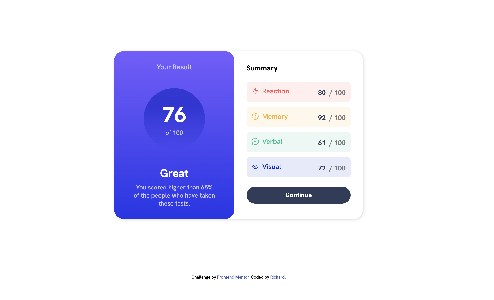

# Frontend Mentor - Results summary component solution

This is a solution to the [Results summary component challenge on Frontend Mentor](https://www.frontendmentor.io/challenges/results-summary-component-CE_K6s0maV). Frontend Mentor challenges help you improve your coding skills by building realistic projects.

## Table of contents

- [Overview](#overview)
  - [The challenge](#the-challenge)
  - [Screenshot](#screenshot)
  - [Links](#links)
- [My process](#my-process)
  - [Built with](#built-with)
  - [What I learned](#what-i-learned)
    <!-- - [Continued development](#continued-development) -->
    <!-- - [Useful resources](#useful-resources) -->
- [Author](#author)
- [Acknowledgments](#acknowledgments)

## Overview

### The challenge

Users should be able to:

- View the optimal layout for the interface depending on their device's screen size
- See hover and focus states for all interactive elements on the page
- **Bonus**: Use the local JSON data to dynamically populate the content

### Screenshot

### Links

- Solution URL: [Add solution URL here](https://github.com/lamepic/frontend-challenges/tree/main/frontend-mentor/result-summary-component)
- Live Site URL: [Add live site URL here](https://result-summary-epic.surge.sh)

## My process

### Built with

- Semantic HTML5 markup
- CSS custom properties
- Flexbox
- Mobile-first workflow

### What I learned

This challenge thought me how to work with some css properties i wasn't really familiar with, i had the oppotunity to use them, now i feel confident about them. But there is more to learn.

## Author

- Website - [Richard Arthur](https://www.iamarthur.web.app)
- Frontend Mentor - [@lamepic](https://www.frontendmentor.io/profile/lamepic)

## Acknowledgments

- Thanks to - [Musread](https://github.com/Musread) for making a contribution on the repo!!!
